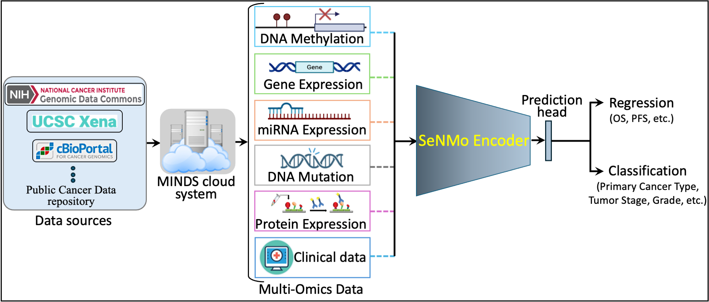
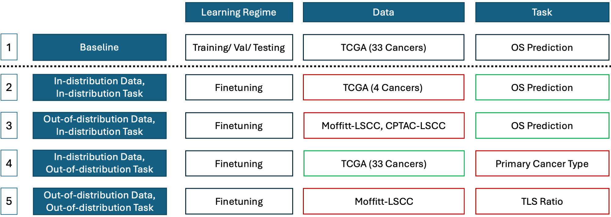

# SeNMo: Self-Normalizing Foundation Model for Enhanced Multi-Omics Data Analysis in Oncology



## Overview

SeNMo is a deep learning model designed to enhance the analysis of multi-omics data in oncology. This repository contains the code and instructions for training, fine-tuning, testing, and ensemble testing of the SeNMo model.



## Table of Contents

- [Requirements](#requirements)
- [Running the SeNMo Training](#running-the-senmo-training)
- [Running the SeNMo Finetuning](#running-the-senmo-finetuning)
- [Running the SeNMo Testing](#running-the-senmo-testing)
- [Running the SeNMo Ensemble Testing](#running-the-senmo-ensemble-testing)
- [Checkpoints](#checkpoints)
- [Embeddings](#embeddings)
- [Paper](#paper)
- [TODO](#todo)

## Requirements

Ensure you have all the necessary dependencies installed. You can install them using the `requirements.txt` file:

```bash
pip install -r requirements.txt
```

## Running the SeNMo Training

To train the SeNMo model with the specified parameters, use the following command:

```bash
python SeNMo_Training.py \
    --regression True \
    --finetune False  \
    --exp_name surv \
    --act_type None \
    --reg_type all \
    --disease pancancer_combined \
    --task surv \
    --gpu_ids 0 \
    --lr 0.0005811726189177087 \
    --weight_decay 0.005978947728252338 \
    --dropout_rate 0.10583716299176746 \
    --batch_size 256 \
    --dataroot <path_to_data> \
    --checkpoints_dir <path_to_checkpoints> \
    --input_size_omic 80697
```

## Running the SeNMo Finetuning

To finetune the SeNMo model with the specified parameters, use the following command:

```bash
python SeNMo_Training.py \
    --regression True \
    --finetune True  \
    --exp_name surv \
    --reg_type all \
    --act_type None \
    --disease pancancer_indl_cancers \
    --task surv \
    --gpu_ids 0 \
    --lr 0.000040189177087 \
    --weight_decay 0.35 \
    --dropout_rate 0.35 \
    --batch_size 16 \
    --niter_decay 8 \
    --dataroot <path_to_data> \
    --checkpoints_dir <path_to_checkpoints> \
    --pretrained_model_dir <path_to_pretrained_model> \
    --cancer 'CPTAC-LUSC' \
    --frozen_layers 0 \
    --input_size_omic 80697
```

## Running the SeNMo Testing

To test the SeNMo model with the specified parameters, use the following command:

```bash
python SeNMo_Testing.py \
    --regression True \
    --exp_name surv \
    --reg_type all \
    --act_type None \
    --disease pancancer_combined \
    --task surv \
    --gpu_ids 0 \
    --lr 0.0005811726189177087 \
    --weight_decay 0.005978947728252338 \
    --dropout_rate 0.10583716299176746 \
    --batch_size 1 \
    --niter_decay 8 \
    --dataroot <path_to_data> \
    --checkpoints_dir <path_to_checkpoints> \
    --pretrained_model_dir <path_to_pretrained_model> \
    --frozen_layers 0 \
    --input_size_omic 80697
```

## Running the SeNMo Ensemble Testing

To perform ensemble testing with the SeNMo model, use the following command:

```bash
python SeNMo_Ensemble.py \
    --regression True \
    --exp_name surv \
    --reg_type all \
    --act_type None \
    --disease pancancer_combined \
    --task surv \
    --gpu_ids 0 \
    --lr 0.0005811726189177087 \
    --weight_decay 0.005978947728252338 \
    --dropout_rate 0.10583716299176746 \
    --batch_size 1 \
    --dataroot <path_to_data> \
    --checkpoints_dir <path_to_checkpoints> \
    --pretrained_model_dir <path_to_pretrained_model> \
    --input_size_omic 80697
```

## Checkpoints

You can find the pre-trained model checkpoints [here](https://huggingface.co/Lab-Rasool/SeNMo/tree/main).

## Embeddings

Access the TCGA molecular embeddings [here](https://huggingface.co/datasets/Lab-Rasool/TCGA/viewer/molecular).

## Paper

For detailed information, refer to the [arXiv paper](https://doi.org/10.48550/arXiv.2405.08226).

## Future Works

- Link to MINDS dataset
- Link to HoneyBee
